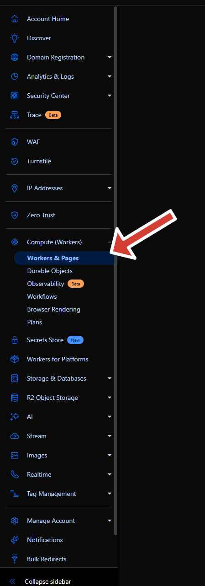
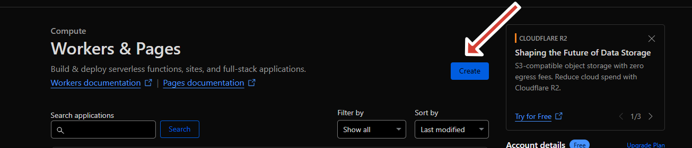
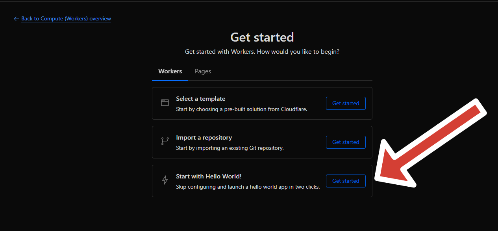
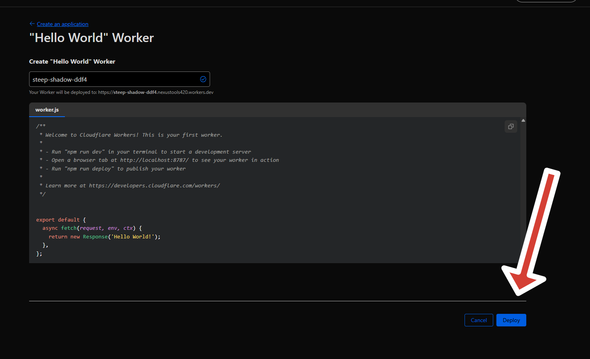

# 🌐 Setting Up Your Cloudflare Worker

> 📁 This guide uses images from the `cloudflare-worker` folder.  
> 🛠 Follow along to deploy your SellAuth proxy in minutes.

---

## 🪜 Step-by-Step Guide

### 🖼️ Step 1: Open Cloudflare Workers

Go to the [Cloudflare Dashboard](https://dash.cloudflare.com/) and navigate to **Workers & Pages**.  

---

### 🖼️ Step 2: Create Worker

click **“Create Worker”**.

---

### 🖼️ Step 3: Clear the Default Code

Choose Hello world template.

---

### 🖼️ Step 4: Change the name if you want and deploy it.

---

### 🖼️ Step 5: Deploy the Worker

Click on edit code.

Paste the full Cloudflare Worker code from the guide.

🔁 Replace:
- `"YOUR-API-KEY"` with your real SellAuth **API key**
- `123456789` with your **Shop ID**

## 💬 Need Help?

Feel free to open an issue or submit a pull request if you'd like to contribute or improve this solution.
